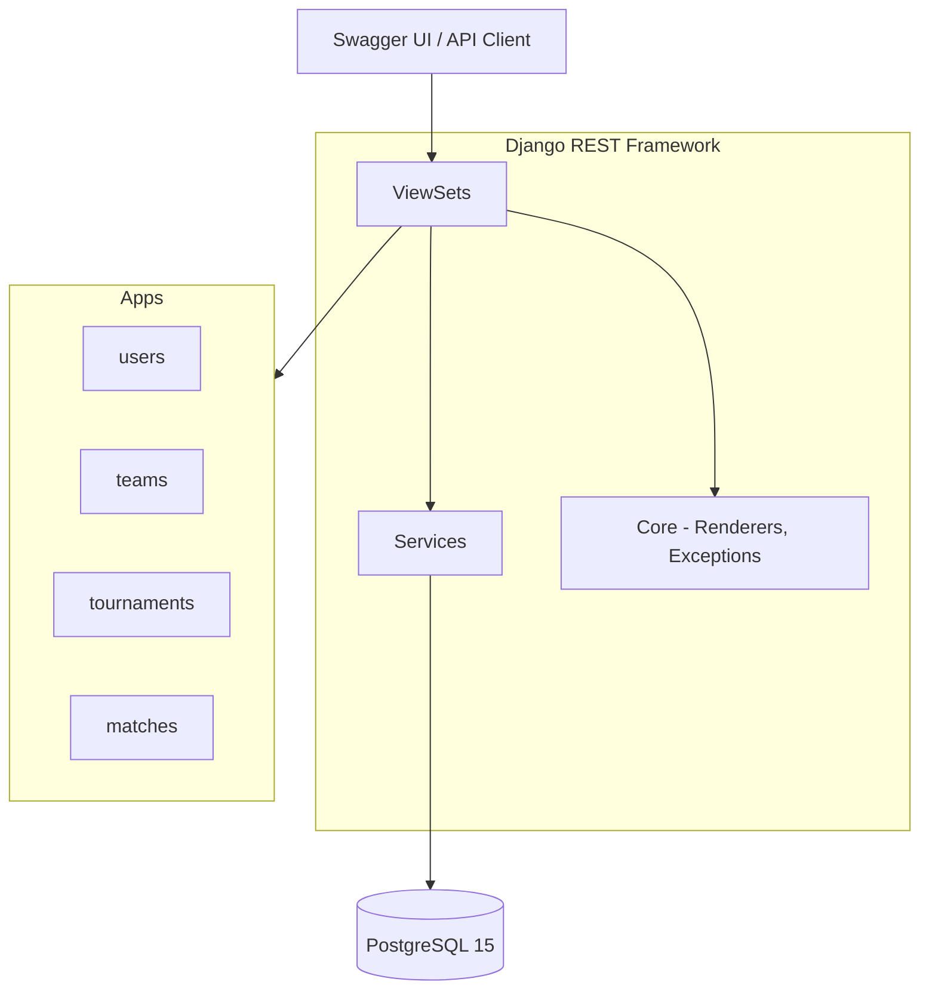

# Architecture Diagram

```mermaid
graph TB
    Client[Swagger UI / API Client]
    
    subgraph Backend[Django REST Framework]
        Views[ViewSets]
        Services[Services]
        Core[Core - Renderers, Exceptions]
    end
    
    subgraph Apps[Apps]
        Users[users]
        Teams[teams]
        Tournaments[tournaments]
        Matches[matches]
    end
    
    DB[(PostgreSQL 15)]
    
    Client --> Views
    Views --> Services
    Views --> Core
    Services --> DB
    Views --> Apps
```
