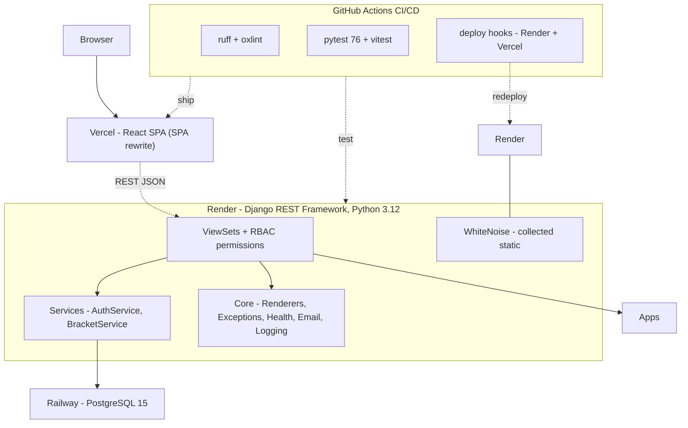

# Architecture Diagram

The backend follows a layered structure. A client — the React SPA on **Vercel** (with an SPA rewrite
so deep links resolve) or Swagger UI — talks to the Django REST Framework **views** hosted on
**Render** (Python 3.12, static files served by **WhiteNoise**), which enforce RBAC permissions
(`IsOrganizer`), delegate business logic to **services** (`AuthService`, `BracketService`), and rely on the
shared **core** package for rendering, exception handling, the health check, email notifications, and
request logging. Each Django **app** (users, teams, tournaments, matches) owns its models and persistence,
and all data is stored in **PostgreSQL 15** on **Railway**. The React frontend consumes the REST API under
`/api/` using JWT authentication (access + refresh tokens). **GitHub Actions** runs lint, the full test
suites, and frontend builds on every push, with deploy hooks shipping `main` to Render and Vercel.
