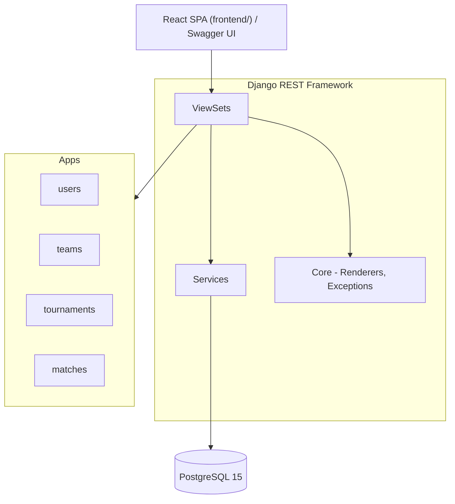

# Architecture Diagram

The backend follows a layered structure. A client — the React SPA in `frontend/` or Swagger UI —
talks to the Django REST Framework **views**, which delegate business logic to **services** and rely on the shared
**core** package for rendering and exception handling. Each Django **app** (users, teams, tournaments, matches)
owns its models and persistence, and all data is stored in **PostgreSQL 15**. The React frontend consumes the REST API under `/api/` using JWT authentication (access + refresh tokens).
