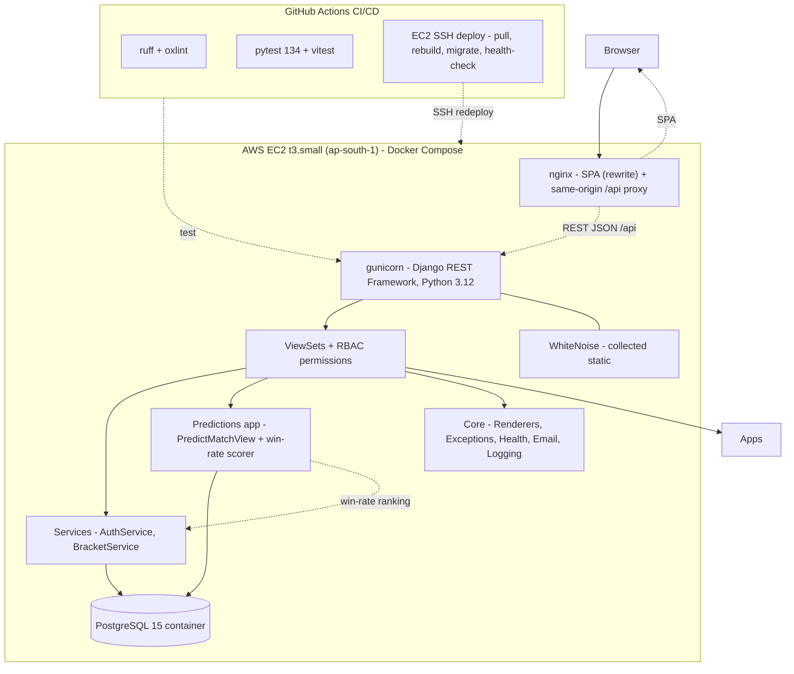

# Architecture Diagram

```mermaid
graph TB
    Client["Browser"]

    subgraph EC2["AWS EC2 t3.small (ap-south-1) - Docker Compose"]
        Nginx["nginx - SPA (rewrite) + same-origin /api proxy"]
        API["gunicorn - Django REST Framework, Python 3.12"]
        Views[ViewSets + RBAC permissions]
        Services[Services - AuthService, BracketService]
        Predict[Predictions app - PredictMatchView + win-rate scorer]
        Core[Core - Renderers, Exceptions, Health, Email, Logging]
        Static["WhiteNoise - collected static"]
        DB[(PostgreSQL 15 container)]
    end

    subgraph CI[GitHub Actions CI/CD]
        Lint["ruff + oxlint"]
        Tests["pytest 134 + vitest"]
        Deploy["EC2 SSH deploy - pull, rebuild, migrate, health-check"]
    end

    Client --> Nginx
    Nginx -. SPA .-> Client
    Nginx -. REST JSON /api .-> API
    API --> Views
    Views --> Services
    Views --> Predict
    Views --> Core
    Services --> DB
    Predict --> DB
    Predict -. win-rate ranking .-> Services
    Views --> Apps
    API --- Static
    CI -. test .-> API
    Deploy -. SSH redeploy .-> EC2
```

The backend follows a layered structure. The whole stack runs on a single AWS EC2 instance
(`t3.small`, `ap-south-1`) via Docker Compose: **nginx** serves the React SPA (with a rewrite so deep
links resolve) and proxies `/api` same-origin to **gunicorn** running the Django REST Framework API
(Python 3.12, static files served by **WhiteNoise**), with **PostgreSQL 15** in its own container. A
client — the SPA or Swagger UI — talks to the Django **views**, which enforce RBAC permissions
(`IsOrganizer`, `IsAdmin`, `IsTeamOwner`), delegate business logic to **services** (`AuthService`,
`BracketService`), and rely on the shared **core** package for rendering, exception handling, the health
check, email notifications (OTP codes, confirmations, results), and request logging. The **predictions**
app serves `GET /api/predictions/match/<id>/` (predicted winner + confidence, scored on demand from
completed matches) to the match list on the Tournament Detail page, and its win-rate ranking feeds the
`POST /api/tournaments/<id>/smart-seed/` action in the tournament seeding flow. Each Django **app** (users, teams, tournaments, matches, predictions) owns its models and persistence.
The React frontend consumes the REST API under `/api/` using JWT authentication (access + refresh
tokens). **GitHub Actions** runs lint, the full test suites, and frontend builds on every push, and on
every push to `main` the deploy job SSH-deploys to EC2 (pull, rebuild images, migrate, health-check).
