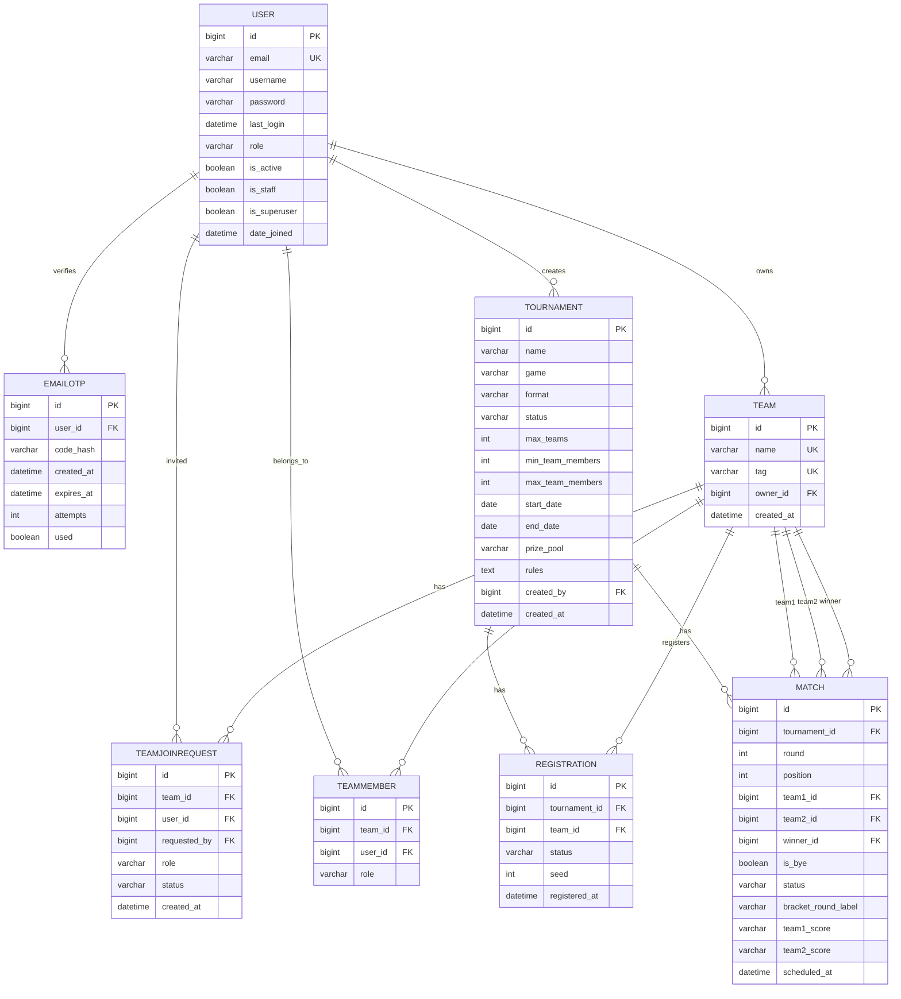

# Entity Relationship Diagram

The database is composed of eight entities. **users** are the base actor: they own teams, belong to teams as
members, create tournaments, receive email OTP codes, and are invited to teams. **teams** group members and register for
tournaments, each registration carrying an optional seed; membership and email invites live in
**team_members** and **team_join_requests**. **email_otps** stores SHA-256-hashed verification codes
with expiry, attempt count, and used flag. **tournaments** have a lifecycle
(`draft → registration_open → registration_closed → in_progress → completed`) and contain
registrations as well as the matches generated for the bracket, where each match references two
teams as team1/team2 and an optional winning team — a completed match with no winner is a Draw.
