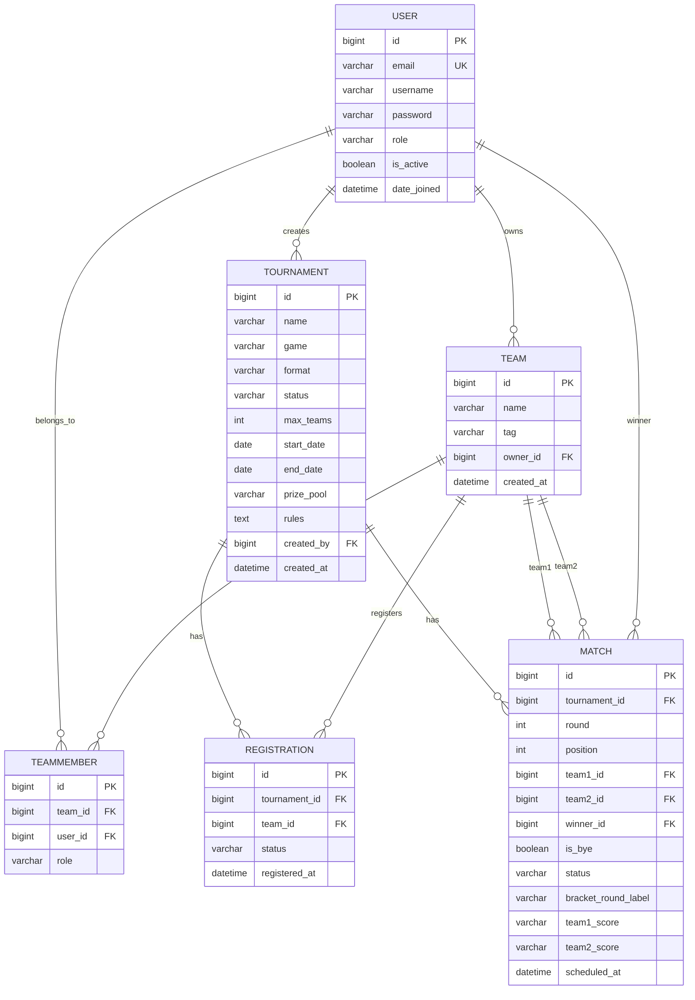

# Entity Relationship Diagram

```mermaid
erDiagram
    USER {
        bigint id PK
        varchar email UK
        varchar username
        varchar password
        varchar role
        boolean is_active
        datetime date_joined
    }
    TEAM {
        bigint id PK
        varchar name
        varchar tag
        bigint owner_id FK
        datetime created_at
    }
    TEAMMEMBER {
        bigint id PK
        bigint team_id FK
        bigint user_id FK
        varchar role
    }
    TOURNAMENT {
        bigint id PK
        varchar name
        varchar game
        varchar format
        varchar status
        int max_teams
        date start_date
        date end_date
        varchar prize_pool
        text rules
        bigint created_by FK
        datetime created_at
    }
    REGISTRATION {
        bigint id PK
        bigint tournament_id FK
        bigint team_id FK
        varchar status
        datetime registered_at
    }
    MATCH {
        bigint id PK
        bigint tournament_id FK
        int round
        int position
        bigint team1_id FK
        bigint team2_id FK
        bigint winner_id FK
        boolean is_bye
        varchar status
        varchar bracket_round_label
        varchar team1_score
        varchar team2_score
        datetime scheduled_at
    }
    USER ||--o{ TEAM : owns
    USER ||--o{ TEAMMEMBER : belongs_to
    TEAM ||--o{ TEAMMEMBER : has
    USER ||--o{ TOURNAMENT : creates
    TOURNAMENT ||--o{ REGISTRATION : has
    TEAM ||--o{ REGISTRATION : registers
    TOURNAMENT ||--o{ MATCH : has
    TEAM ||--o{ MATCH : team1
    TEAM ||--o{ MATCH : team2
    USER ||--o{ MATCH : winner
```
