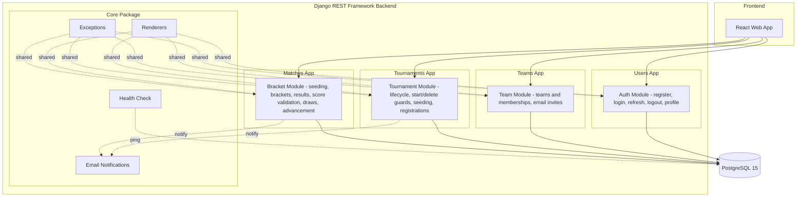

# Module Diagram

The platform is split into four functional modules, each backed by a Django app. The **Auth module** (`users` app)
handles registration, login, token refresh, logout (blacklist), and profile management. The **Team module** (`teams` app) manages
teams and their memberships, including email-based member invites. The **Tournament module** (`tournaments` app) drives the tournament lifecycle
(`draft → registration_open → registration_closed → in_progress → completed`, with start/delete guards and
seed management) and team registrations, with eligibility validation. The **Bracket module** (`matches` app) contains the core esports
logic: seeding, single-elimination bracket generation, match state transitions, result submission with score
validation (negatives rejected, winner must outscore loser, equal scores recorded as Draws), and automatic
winner advancement. The shared **Core package** (`app/core`) provides the custom renderers and exception handlers
used by all modules, plus the health check, email notifications, and request logging; every module persists
to the shared **PostgreSQL 15** database.
