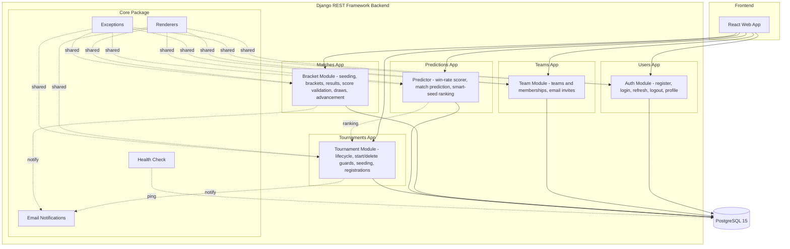

# Module Diagram

```mermaid
graph TB
    subgraph Frontend[Frontend]
        UI[React Web App]
    end

    subgraph Backend[Django REST Framework Backend]
        subgraph UsersApp[Users App]
            Auth[Auth Module - register, login, refresh, logout, profile]
        end
        subgraph TeamsApp[Teams App]
            TeamService[Team Module - teams and memberships, email invites]
        end
        subgraph TournamentsApp[Tournaments App]
            TournamentService[Tournament Module - lifecycle, start/delete guards, seeding, registrations]
        end
        subgraph MatchesApp[Matches App]
            BracketService[Bracket Module - seeding, brackets, results, score validation, draws, advancement]
        end
        subgraph PredictionsApp[Predictions App]
            Predictor[Predictor - win-rate scorer, match prediction, smart-seed ranking]
        end
        subgraph Core[Core Package]
            Renderers[Renderers]
            Exceptions[Exceptions]
            Health[Health Check]
            Email[Email Notifications]
        end
    end

    DB[(PostgreSQL 15)]

    UI --> Auth
    UI --> TeamService
    UI --> TournamentService
    UI --> BracketService
    UI --> Predictor
    Auth --> DB
    TeamService --> DB
    TournamentService --> DB
    BracketService --> DB
    Predictor --> DB
    Predictor -. ranking .-> TournamentService
    Renderers -. shared .-> Auth
    Renderers -. shared .-> TeamService
    Renderers -. shared .-> TournamentService
    Renderers -. shared .-> BracketService
    Renderers -. shared .-> Predictor
    Exceptions -. shared .-> Auth
    Exceptions -. shared .-> TeamService
    Exceptions -. shared .-> TournamentService
    Exceptions -. shared .-> BracketService
    Exceptions -. shared .-> Predictor
    Health -. ping .-> DB
    TournamentService -. notify .-> Email
    BracketService -. notify .-> Email
```

The platform is split into five functional modules, each backed by a Django app. The **Auth module** (`users` app)
handles registration with email OTP verification, login (blocked until verified), token refresh, logout (blacklist),
profile management, and admin user management (`IsAdmin` list/search/role/activation/deletion endpoints). The **Team module** (`teams` app) manages
teams and their memberships, including email-based member invites. The **Tournament module** (`tournaments` app) drives the tournament lifecycle
(`draft → registration_open → registration_closed → in_progress → completed`, with start/delete guards and
seed management) and team registrations, with eligibility validation. The **Bracket module** (`matches` app) contains the core esports
logic: seeding, single-elimination bracket generation, match state transitions, result submission with score
validation (negatives rejected, winner must outscore loser, equal scores recorded as Draws), and automatic
winner advancement. The **Predictor module** (`predictions` app) scores matches on demand with a
scikit-learn `LogisticRegression` over `[win_rate_diff, seed_diff]` (`GET
/api/predictions/match/<id>/`, shown as "AI pick" rows on the Tournament Detail page) and ranks
registrations strongest-first for the `POST /api/tournaments/<id>/smart-seed/` action behind the
"Smart seed" button on the Seeding page. The shared **Core package** (`app/core`) provides the custom renderers and exception handlers
used by all modules, plus the health check, email notifications, and request logging; every module persists
to the shared **PostgreSQL 15** database. Registration is verified by email OTP
(inactive account → 6-digit code → activation; login blocked until verified), and a
dedicated admin command center (`/admin`, admin role only) covers user management
plus full tournament/team tables — the Django admin is not needed day-to-day.
